## Juan David Torres Velasco 
# Manual to use OpenCV + CUDA in Google Colab


The objective of this manual is to show how to work with OpenCV in Google Colab given that
there can be some hardware issues that can prevent us to do certain development like the use of
CUDA in a computer without an NVIDIA GPU.


I will be using some pieces of code from the implementation steganography with CUDA project
as way to show how OpenCV can be used.

### 1. Installing Google Colab
Firstly, it is necessary to connect Google Colab to your Google account (if you already have it
connected skip to the next step). To do this you will have to click on the New button, the same
one used to create new folders or documents, then click on More and afterwards click on
Connect more apps.


  
  
_Figure 1 New button_

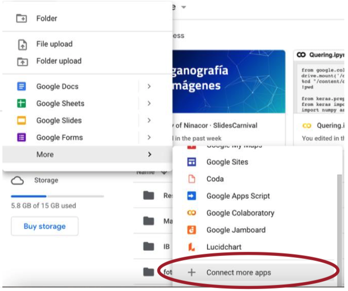

_Figure 2 Connect more apps_

Then search for Colaboratory and add it to Google Drive using the drive button in the down right
corner

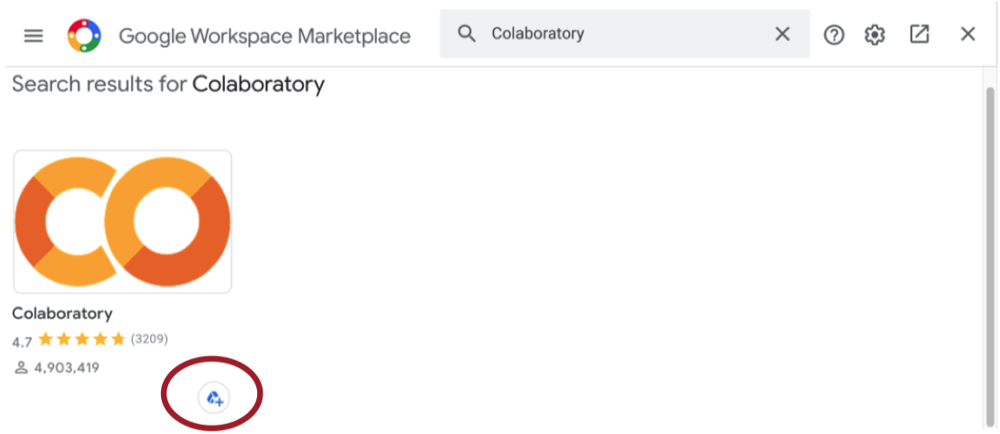

_Figure 3 Install Colaboratory_


Click install and you will have to accept the permissions in order to install it.

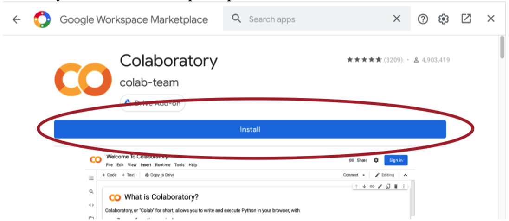

_Figure 4 Install Colaboratory_

### 2. Creating Notebook


Once Google Colab is installed, is necessary to create a Google Colab notebook through Google
Drive, it can be created from any folder, but to have a better organization it will be done on the
same folder where the CUDA files are going to be. Open the folder you’re going to be using and
click the New button and select Google Colaboratory. This will create your Colab Notebook


_Figure 5 Create new Notebook_

### 3. Connect the GPU to Google Colab

To change the runtime, you have to click on edit, then notebook settings as it is shown in the
figure 6


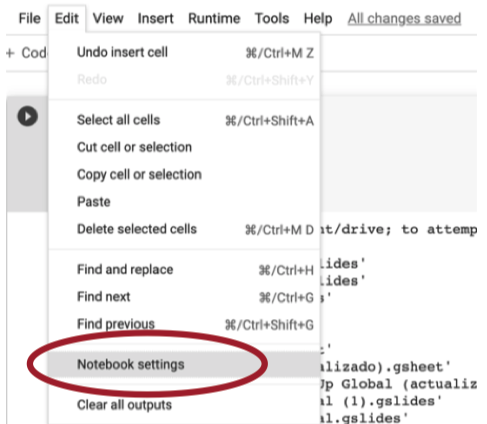

_Figure 6 Notebook settings_

Once in the notebook settings you will have to change the hardware accelerator to GPU and save
the settings as it is shown in the figure 7.

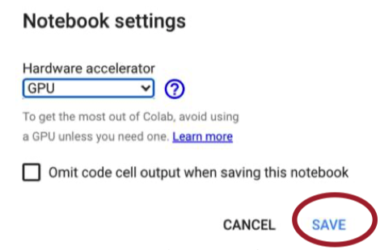

_Figure 7 Hardware accelerator_

### 4. Connect Drive to Google Colab local environment

Disclaimer. You will have to do this every time you reconnect to your Google Colab notebook.

You will have to add a piece of code to your Google Colab Notebook, to do so you will have to
create a code block clicking on + Code.

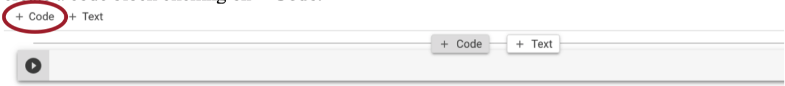

_Figure 8 Insert Snippet of Code_

Then add the following snippet of code:
```python
from google.colab import drive
drive.mount('/content/drive')
%cd "/content/drive/My Drive/YourFolder"
!pwd
```
If you added the folder to the root of your Google Drive you will have to replace “YourFolder”
with the name of your folder. This folder is going to be the one in where the CUDA files will be


present. Make sure that the path to your folder is correct, note that the root Drive Folder is
**"/content/drive/My Drive”**.

Run the snippet of code and once you run it a prompt like the following will appear. You will have to click
on the link that is shown, follow the instruction and copy the authorization code to your clipboard using
the clipboard button.

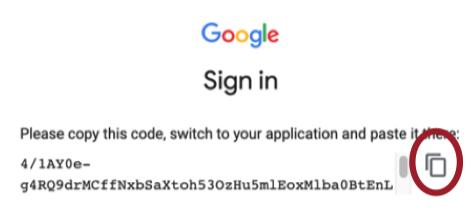

_Figure 9 Authorization code copy_

Then you will have to paste the code to the text field shown in the figure 10 and press the enter
key.

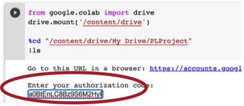

_Figure 10 Authorization Code Paste_

### 5. CUDA File

Then you will have to create new files in the folder you have the Google Colab notebook. You
can create them using the Google Drive “Text Editor” that can be installed as the Google Colab
app was installed. You can also upload the files from your computer.

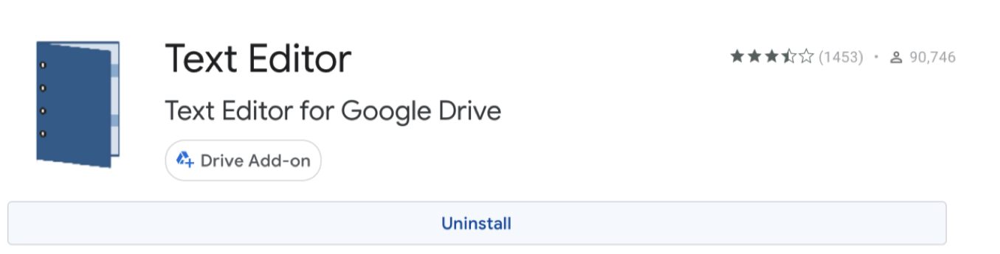

_Figure 11 Text Editor App_

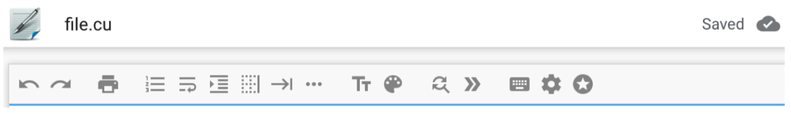

_Figure 12 File CUDA Creation_

Once the file is created you will have to add the following snippet of code to the header.

```c
#include <stdio.h>
#include <stdlib.h>
#include <opencv2/core/core.hpp>
#include <opencv2/highgui/highgui.hpp>
#include <opencv2/imgproc/imgproc.hpp>
#include <opencv2/opencv.hpp>

using namespace cv;
```

Now you can write whatever code you’d like in CUDA C using Open CV, for practicality I will
add the following code which reads an image and makes an exact copy of it using CudaMalloc
and CudaMemcpy. This code is a small part of my project of steganography, if you want to run it
make sure you have an image file called image.png and that is on the same folder as the CUDA
file.
```c
_int_ main(){
Mat image = imread("image.png");
_int_ imageSize = image.step * image.rows;

unsigned char *d_image;
cudaMalloc<unsigned char>(&d_image, imageSize);


cudaMemcpy(d_image, image.ptr(), imageSize, cudaMemcpyHostToDevice);

Mat output(image.rows, image.cols, CV_8UC3);
cudaMemcpy(output.ptr(), d_image, imageSize, cudaMemcpyDeviceToHost);
imwrite("output.png", output);
return 0 ;
}
```

### 6. 1 Running terminal Google Colab Pro

To run the code if you have Google Colaboratory Pro you can use the terminal button in the
below left corner as it shown in the figure 13.

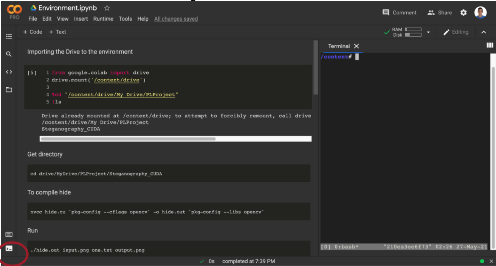

_Figure 13 Google Colab Pro Terminal_

Then you will have to go to the directory where the files are located inserting the following code
in the terminal.
cd drive/MyDrive/MyFolder

### 6.2 Running terminal Google Colab free edition

If you don’t have Google Colab Pro you can add to snippets of code to your notebook that will
create a terminal on the interface. It is important that these codes are separated as they work into
two pieces of code.

```javascript
from IPython.display import JSON
from google.colab import output
from subprocess import getoutput
import os


_def_ shell( _command_ ):
if command.startswith('cd'):
path = command.strip().split(maxsplit= 1 )[ 1 ]
os.chdir(path)
return JSON([''])
return JSON([getoutput(command)])
output.register_callback('shell', shell)
```
```javascript
#@title Colab Shell
%%html
<div id=term_demo></div>
<script src="https://code.jquery.com/jquery-latest.js"></script>
<script
src="https://cdn.jsdelivr.net/npm/jquery.terminal/js/jquery.terminal.min.js"></script>
<link href="https://cdn.jsdelivr.net/npm/jquery.terminal/css/jquery.terminal.min.css"
rel="stylesheet"/>
<script>
$('#term_demo').terminal(async function(command) {
if (command !== '') {
try {
let res = await google.colab.kernel.invokeFunction('shell', [command])
let out = res.data['application/json'][ 0 ]
this.echo(new String(out))
} catch(e) {
this.error(new String(e));
}
} else {
this.echo('');
}
}, {
greetings: 'Welcome to Colab Shell',
name: 'colab_demo',
height: 250 ,
prompt: 'colab > '
});
```

After you run these two lines of code the terminal will appear as the figure 14 shows. The
terminal’s current folder is the folder you wrote in the step 4.

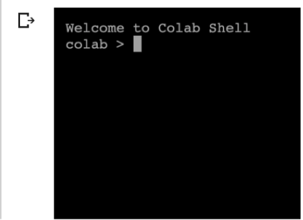

_Figure 14 Terminal_

### 7. Compile and Run

To compile the Cuda file because everything is already preinstalled in Google Colab you will
only have to run the following code on which ever terminal you are using. Change file.cu to the
name of your file to compile the program.
```sh
nvcc file.cu `pkg-config --cflags opencv` -o file.out `p-config --libs opencv`
```
Once it is compiled to run the program you will have to run the following code on the terminal.
The name of the file changes depending on the file.out line on the code above.
```sh
./file.out
```

## IV. References

[Kessler, G. (2002, septiembre). Steganography. GaryKessler.](https://www.garykessler.net/library/steganography.html)

[Choudary, A. (2020, 25 noviembre). Steganography Tutorial _–_ A Complete Guide For Beginners. Edureka.](https://www.edureka.co/blog/steganography-tutorial)

[Korakot, A. (2019, 13 diciembre). How can I run shell (terminal) in Google Colab? Stack Overflow.](https://stackoverflow.com/questions/59318692/how-can-i-run-shell-terminal-in-google-colab)

[Wilson, D. (2014, 28 abril). Convert a string of binary into an ASCII string (C++). Stack Overflow.](https://stackoverflow.com/questions/23344257/convert-a-string-of-binary-into-an-ascii-string-c/)


