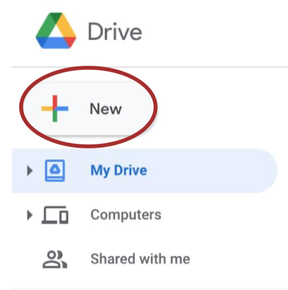

# Steganography with CUDA using Google Colab

## Juan David Torres Velasco 

Abstract - The following document show the implementation of Steganography in images
using CUDA C and OpenCV with Google Colab as the running environment.

## I. Introduction


Hiding information has been always necessary for humankind and the beginning of the digital era
brought a lot of ways to hide information. Steganography is one of the many ways to encode,
encrypt or hide information, this is done by hiding the information in the data.

The project’s objective was to implement steganography in images using CUDA C and OpenCV,
given that I don’t have a computer with an NVIDIA GPU to run CUDA I had to use Google Colab
to implement my solution. But because there are no solutions on the internet on how to use
OpenCV with Google Colab I had to find a solution and the following includes a manual that
explains step by step how to use OpenCV with Colab.

## II. Steganography

Steganography is a way to hide data into data meaning that you can hide files inside of other files.
There are many ways to implement steganography, data can be hidden on images, audio and any
other representation of data imagined. It is important that the file where the data is being hidden
doesn’t change, therefore in images a good technique to use to hide data is the LSB or least
significant bit which changes on each pixel the least significative bit on every color.

The LSB technique hides each bit of the data that wants to be hidden in one color of each pixel
and this was the technique I used for my implementation. Given that CUDA can do many
operations at once with the use of threads and the GPU, then the idea is to use each thread to hide
only one bit from the message taken from a text file. Because each bit is independent from each
other steganography is a great way to apply the CUDA programming language and separate even
the colors of each pixel to change their least significant bit.

II.I Hiding
To do the process of hiding I received the name of the files that were going to be used as arguments
in the terminal the name of the image file where the message wants to be hidden, the text file with
the message that wants to be hidden and finally the name of the output image that is going to
contain the message hidden. Once I have the files, I read first the text file and obtain the message,
obtain the image file with OpenCV and check whether the message fits into the image or not you
have to check if (widthImage * heightImage * 3) > ( (textSize + 1) * 8).

After doing so the next step was to do a cudaMalloc to allocate memory on the device and copy
the image to it with cudaMemcpy to access the image from the gobal function and change the
pixels from the image. Then to do the global function it is important to create the 3d Blocks and
Threads with dim3, for the case of Blocks use ((image.cols+ ThreadsPerBlock-
1)/ThreadsPerBlock) and for the second attribute instead of using columns use image.rows, and


for the Threads use for both attributes ThreadsPerBlock. Then the call to the global function is
done and we use the previously created Blocks and Threads and pass as paremeters to the global
function the d_image, the d_text which is the message to use in the device and the textSize which
is going to be de actual size of the process of hiding.

The global function will change the least significant bit of every pixel RGB component, to do so
the offset is calculated as col + row * blockDim.x * gridDim.x where col = blockIdx.x *
blockDim.x + threadIdx.x and the row = blockIdx.y * blockDim.y + threadIdx.y. The index to use
for the text then is calculated as index = offset/8.

After this is done the bit_count = 7 – (offset%8) which is how much the text[index] will be shifted
to the right so the actual least significant bit on the already shifted bits will be the change on the
pixel color.

The change of the LSB is done through an if charBit &1 where charBit is the already shifted bits
and if the following if is 1 the image[offset] |= 1which will change the LSB to 1 but if the
conditional is false then the LSB is change to 0 doing the following image[offset] &= ~1.

Once the bits are changed the device image is copied to the output image that is on the host, finally
I added eight more bits to the message so the program that show the hidden message knows when
to stop and finllay use the imwrite function on OpenCV to write the image intro the system with
the name of the file specified when the program is run.

II.II Showing

The showing program receives as argument the image file where the hidden message is in, and one
the program has the name of the file it uses imread to read the image using OpenCV. The image
must be used the same way as the hiding program, the image is copied to the device and create the
same Blocks and Threads as the hiding program as well. Then the gobal function must be called
and the attributes passed the image, where the text is going to be saved and finally the width*height
which is the size of the image.

In the global function the offset is used as well as in the hiding code, the text then will change the
text[offset] to 0 by default but if the condition that (image[offset]&1) is 1 this means that the LSB
of the corresponding color component is 1 and the text[offset] is changed to 1 using text[offset] |=

1. Once the text is gathered the host will convert each of the numbers contained in the text to a
char using a function and if the char is “00000000” then it will stop reading and print the message
that was hidden on the image.

## III. Manual to use OpenCV + CUDA in Google Colab

The objective of this manual is to show how to work with OpenCV in Google Colab given that
there can be some hardware issues that can prevent us to do certain development like the use of
CUDA in a computer without an NVIDIA GPU.


I will be using some pieces of code from the implementation steganography with CUDA project
as way to show how OpenCV can be used.

1. Installing Google Colab
Firstly, it is necessary to connect Google Colab to your Google account (if you already have it
connected skip to the next step). To do this you will have to click on the New button, the same
one used to create new folders or documents, then click on More and afterwards click on
Connect more apps.


<figure class="image">
  
  <figcaption>Figure 1</figcaption>
</figure>

_Figure 1 New button_


_Figure 2 Connect more apps_

Then search for Colaboratory and add it to Google Drive using the drive button in the down right
corner

_Figure 3 Install Colaboratory_


Click install and you will have to accept the permissions in order to install it.

```
Figure 4 Install Colaboratory
```
2. Creating Notebook


Once Google Colab is installed, is necessary to create a Google Colab notebook through Google
Drive, it can be created from any folder, but to have a better organization it will be done on the
same folder where the CUDA files are going to be. Open the folder you’re going to be using and
click the New button and select Google Colaboratory. This will create your Colab Notebook

```
Figure 5 Create new Notebook
```
3. Connect the GPU to Google Colab

To change the runtime, you have to click on edit, then notebook settings as it is shown in the
figure 6


```
Figure 6 Notebook settings
```
Once in the notebook settings you will have to change the hardware accelerator to GPU and save
the settings as it is shown in the figure 7.

```
Figure 7 Hardware accelerator
```
4. Connect Drive to Google Colab local environment

Disclaimer. You will have to do this every time you reconnect to your Google Colab notebook.

You will have to add a piece of code to your Google Colab Notebook, to do so you will have to
create a code block clicking on + Code.

```
Figure 8 Insert Snippet of Code
```
Then add the following snippet of code:
```python
from google.colab import drive
drive.mount('/content/drive')
%cd "/content/drive/My Drive/YourFolder"
!pwd
```
If you added the folder to the root of your Google Drive you will have to replace “YourFolder”
with the name of your folder. This folder is going to be the one in where the CUDA files will be


present. Make sure that the path to your folder is correct, note that the root Drive Folder is
**"/content/drive/My Drive”**.

Run the snippet of code and once you run it a prompt
like the following will appear. You will have to click
on the link that is shown, follow the instruction and
copy the authorization code to your clipboard using
the clipboard button.

Then you will have to paste the code to the text field shown in the figure 10 and press the enter
key.

```
Figure 10 Authorization Code Paste
```
5. CUDA File

```
Figure 9 Authorization code copy
```

Then you will have to create new files in the folder you have the Google Colab notebook. You
can create them using the Google Drive “Text Editor” that can be installed as the Google Colab
app was installed. You can also upload the files from your computer.

```
Figure 11 Text Editor App
```
## Figure 12 File CUDA Creation

Once the file is created you will have to add the following snippet of code to the header.

```c
#include <stdio.h>
#include <stdlib.h>
#include <opencv2/core/core.hpp>
#include <opencv2/highgui/highgui.hpp>
#include <opencv2/imgproc/imgproc.hpp>
#include <opencv2/opencv.hpp>

using namespace cv;
```

Now you can write whatever code you’d like in CUDA C using Open CV, for practicality I will
add the following code which reads an image and makes an exact copy of it using CudaMalloc
and CudaMemcpy. This code is a small part of my project of steganography, if you want to run it
make sure you have an image file called image.png and that is on the same folder as the CUDA
file.
```c
_int_ main(){
Mat image = imread("image.png");
_int_ imageSize = image.step * image.rows;

unsigned char *d_image;
cudaMalloc<unsigned char>(&d_image, imageSize);


cudaMemcpy(d_image, image.ptr(), imageSize, cudaMemcpyHostToDevice);

Mat output(image.rows, image.cols, CV_8UC3);
cudaMemcpy(output.ptr(), d_image, imageSize, cudaMemcpyDeviceToHost);
imwrite("output.png", output);
return 0 ;
}
```

6. 1 Running terminal Google Colab Pro

To run the code if you have Google Colaboratory Pro you can use the terminal button in the
below left corner as it shown in the figure 13.

```
Figure 13 Google Colab Pro Terminal
```
Then you will have to go to the directory where the files are located inserting the following code
in the terminal.
cd drive/MyDrive/MyFolder

6.2 Running terminal Google Colab free edition

If you don’t have Google Colab Pro you can add to snippets of code to your notebook that will
create a terminal on the interface. It is important that these codes are separated as they work into
two pieces of code.

```javascript
from IPython.display import JSON
from google.colab import output
from subprocess import getoutput
import os


_def_ shell( _command_ ):
if command.startswith('cd'):
path = command.strip().split(maxsplit= 1 )[ 1 ]
os.chdir(path)
return JSON([''])
return JSON([getoutput(command)])
output.register_callback('shell', shell)
```
```javascript
#@title Colab Shell
%%html
<div id=term_demo></div>
<script src="https://code.jquery.com/jquery-latest.js"></script>
<script
src="https://cdn.jsdelivr.net/npm/jquery.terminal/js/jquery.terminal.min.js"></script>
<link href="https://cdn.jsdelivr.net/npm/jquery.terminal/css/jquery.terminal.min.css"
rel="stylesheet"/>
<script>
$('#term_demo').terminal(async function(command) {
if (command !== '') {
try {
let res = await google.colab.kernel.invokeFunction('shell', [command])
let out = res.data['application/json'][ 0 ]
this.echo(new String(out))
} catch(e) {
this.error(new String(e));
}
} else {
this.echo('');
}
}, {
greetings: 'Welcome to Colab Shell',
name: 'colab_demo',
height: 250 ,
prompt: 'colab > '
});
```

After you run these two lines of code the terminal will appear as the figure 14 shows. The
terminal’s current folder is the folder you wrote in the step 4.

```
Figure 14 Terminal
```
7. Compile and Run

To compile the Cuda file because everything is already preinstalled in Google Colab you will
only have to run the following code on which ever terminal you are using. Change file.cu to the
name of your file to compile the program.
```sh
nvcc file.cu `pkg-config --cflags opencv` -o file.out `p-config --libs opencv`
```
Once it is compiled to run the program you will have to run the following code on the terminal.
The name of the file changes depending on the file.out line on the code above.
```sh
./file.out
```
## IV. Conclusion

The use of steganography in images can be used by many people as a way to pass secret
messages from devices, right now that many of us are afraid that Google or Facebook are spying
on us and using our information for their benefit the security and privacy has become a very
valuable asset.

The use of CUDA for steganography can optimize a lot of the time that the message is being
hidden in the image and can be a great way to hide big data files into much bigger files.

But right because not everybody has access to an NVIDIA GPU a great way to do this
implementation is with Google Colab and with this manual will help more people be able to do
images processing and implementations using CUDA and OpenCV because there is no
information on the internet on how to do it. I’m satisfied that this will help a lot of people in the course and around the world that wants to implement CUDA without the constraint of needing a
NVIDIA GPU.

## V. References

[Kessler, G. (2002, septiembre). Steganography. GaryKessler.](https://www.garykessler.net/library/steganography.html)

[Choudary, A. (2020, 25 noviembre). Steganography Tutorial _–_ A Complete Guide For Beginners. Edureka.](https://www.edureka.co/blog/steganography-tutorial)

[Korakot, A. (2019, 13 diciembre). How can I run shell (terminal) in Google Colab? Stack Overflow.](https://stackoverflow.com/questions/59318692/how-can-i-run-shell-terminal-in-google-colab)

[Wilson, D. (2014, 28 abril). Convert a string of binary into an ASCII string (C++). Stack Overflow.](https://stackoverflow.com/questions/23344257/convert-a-string-of-binary-into-an-ascii-string-c/)


